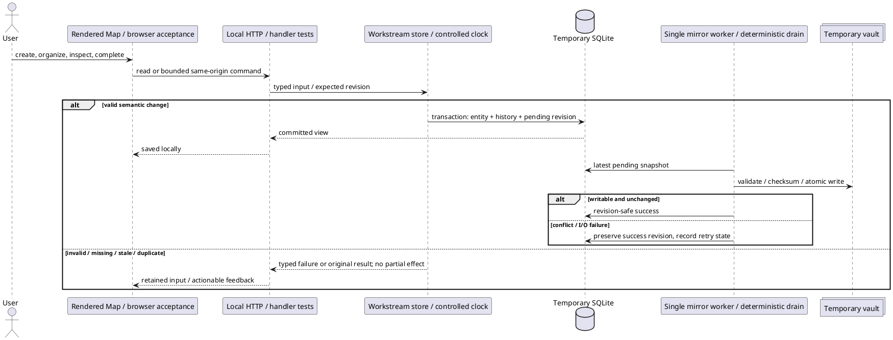

# Workstreams + Map: execution and verification

Approved for implementation on 2026-09-20. The user authorized a separate clean worktree, GPT-5.6 Terra workers, routine design decisions within the approved design, and a background local preview. Product contract: [Workstreams + Map](../specs/workstreams-map.md). Baseline: `ee6b28ff1072e7e1b9e12dc9f951af13943f7a59`.

The `/implement` markdown-plan loop applies to the slices below. No external tickets, provider writes, or new integrations are part of this change. The original checkout's research, PoC, scripts, and README edits remain untouched.

## What already exists

- Go 1.25 service, embedded templates/static assets, vendored Tailwind browser runtime, SQLite additive migrations, local cached PRs, safe Goldmark rendering, and HTTP tests using temporary SQLite files.
- `docs/designs/APPROVED.md` and the selected Paper Amber mockup are the design system; there is no separate DESIGN.md. The approved direction takes precedence over generic design-skill styling recommendations.
- Existing PR/Sessions pages keep their presentation and behavior. They gain only a Map navigation link.
- Existing release pipeline and version command continue to ship the same binary. No new production artifact/framework is introduced.

## Design review (all seven passes)

| Pass | Initial → resolved | Decision |
|---|---|---|
| Information architecture | 9 → 10 | Workstream navigation first, selected outcome and attention second, secondary unavailable context last. Centre is the largest desktop lane. |
| Interaction states | 8 → 10 | Use the state table below; save status and vault status remain distinct. |
| User journey | 9 → 10 | Create → organize → inspect reasons → act → explicitly complete; retain history and stable URLs throughout. |
| Intentional app layout | 10 → 10 | No new decorative cards, gradients, hero, motion, or fabricated gauges. Dense operational layout from the approved mockup. |
| Design system | 9 → 10 | Tailwind-only utilities, exact approved palette, Space Grotesk chrome and JetBrains Mono data with local fallbacks. |
| Responsive/accessibility | 8 → 10 | Explicit document order, mobile skip links, native forms, 44px interactive targets, visible focus and contained graph overflow. |
| Unresolved decisions | 7 → 10 | Centre-panel forms, native shortcut-help dialog, user-initiated vault opening; no additional design scope deferred. |

These ratings assess specification completeness, not measured quality of unbuilt UI. Browser verification is a shipping gate.

### Layout and forms

Desktop: masthead and peer navigation; six-gauge strip; workstream selector on the left, selected detail in the centre, unavailable inbound/calendar context on the right. Staff radar remains beneath the selector; draft actions remain beneath the selected detail. All unavailable surfaces use brief explanations and no active-looking controls.

At 768px and 375px: selector, selected detail, then secondary context in document order. Provide jump-to-detail and jump-to-workstreams links so a long selector does not trap mobile or keyboard navigation. Navigation wraps rather than hiding core pages in a new menu. Graph overflow is confined to its labelled region; text/list alternative remains usable without horizontal scrolling.

Create/edit use an inline full-width form in the centre panel, not nested modals. Headings name the action and entity. Labels remain visible; required fields and limits are explicit. Save/Cancel are always present. Validation and conflict feedback retains typed values, focuses an error summary, and offers reload/review without silently replacing edits. Lifecycle and detach/move actions use explicit confirmation forms. Only keyboard help uses a native dialog, with Escape and focus restoration.

Use paper `#F5F1E8`, panel `#FBF8F1`, sunken `#ECE6D6`, ink `#1F1B16`, borders `#C8C3B5`, amber `#D88A2C`. Amber is the sole status accent, paired with text and ASCII indicators. Use darker ink for small labels to preserve readable contrast; no dependency on externally loaded fonts for layout.

### Interaction-state coverage

| Feature | Loading | Empty | Error | Success | Partial |
|---|---|---|---|---|---|
| Selector/search | Native navigation; preserve current view | Create workstream, or clear filters | Read failure with reload | Selected row and stable URL | Page count and next/previous |
| Create/edit | Disable duplicate submission, Saving label | Labelled fields, no fake examples | Inline fields + summary; preserve input | Select saved record; Saved in Cockpit | Conflict retains draft and provides reload/review |
| Items/source picker | Local lookup pending label | Add relevant kind / no matching cached PR | Invalid URL or unavailable local source explained | Same selected detail with updated counts | Cached freshness unknown, no provider claim |
| Graph/timeline | Native navigation | Explain no related items/history yet | Read failure and reload | Nodes and list target identical details | Graph cap and timeline pagination visible |
| Lifecycle | Confirming save | Not applicable | List unresolved obligations / missing reason | Explicit completed/archived banner | Read-only until reopen/restore |
| Mirror | Pending, separate from saved | No exports yet / disabled | Conflict/error and reconcile/retry instructions | Last successful export time | Per-entity and workstream status, no false synced time |

### Journey

| Moment | User action | Intended experience | Verification |
|---|---|---|---|
| First 5 seconds | Open Map | Understand local workstreams and where to create one | Empty page and unavailable panels |
| First 5 minutes | Create Credits v1, add task/reference/ask/signal | See explicit obligations and source context separately | HTTP acceptance + browser walkthrough |
| Daily use | Search, inspect attention, keyboard navigate | Know why an item needs attention, not infer from colour | Time/attention cases and keyboard browser checks |
| Completion | Record outcome, confirm outstanding work | Completion is deliberate and reversible | Lifecycle and stale-edit tests |
| Long-term archive | Reopen/rename, inspect Markdown | Stable identity and trustworthy saved-versus-exported state | Restart, conflict/recovery, stable path tests |

## Engineering decisions

Keep one local domain store and one mirror worker, in the existing package. More than eight files are justified by the complete approved module (domain, storage, HTTP, template/script, worker, tests), not new deployment layers. The user requested the full spec; no capability is silently reduced to a prototype.

Planned additive schema, before implementation:

| Table | Responsibility / constraints |
|---|---|
| workstreams | Opaque ID, metadata, active/completed lifecycle, independent archive state, revision/timestamps |
| sources | Canonical identity, safe HTTP(S) URL, optional local PR foreign key; unique canonical identity |
| workstream_items | Fixed task/reference/ask/signal kind, parent/source references, validated kind-specific fields, revision, recoverable detachment |
| decisions | Immutable note, optional related item/source, parent and stable ID |
| timeline_events | Append-only semantic event, stable ordering and parent pagination indexes |
| mirror_states | Entity key, desired/success revisions, checksum, attempts, bounded retries and operational status |
| operation_receipts | Persistent operation identity and result; retries cannot duplicate mutations |

Fixed states get SQL checks; reference deduplication gets a partial unique parent/source index. Parent, source, lifecycle, deadline, history-order, and pending-export lookups are indexed. Existing tables remain intact. Backend owns the exact schema and exports stable typed contracts to UI/mirror workers before they depend on it.

Writes validate types/lengths/URLs/parent state and expected revisions, then atomically persist semantic changes, history, and mirror scheduling. Filesystem work happens only after commit. Reads share one clock snapshot and use bounded SQL pages plus dataset-wide aggregate queries. The graph caps at 100; normal pages cap at 50. No provider calls, URL previews, or writes on GET.

Use Go's standard-library cross-origin protection without bypass patterns; preserve safe methods as read-only. Use parameterized SQL, bounded bodies, escaped templates and safe Markdown. User-visible failures are typed validation/not-found/conflict/unavailable messages, not SQL or filesystem dumps.

The mirror uses stable-ID paths, a held `os.Root`, regular-file checks, checksum comparison, sibling temporary files and atomic replacement. Reject symlinks for managed paths and target files. Recovery never grants force-overwrite permission. Ordinary external edits and path collisions are tested. Portable filesystems cannot promise compare-and-swap replacement against a hostile concurrent filesystem writer; retain any displaced content where practical and do not claim such a guarantee. This is a local archival tool, not a sandbox against processes with the same filesystem privileges.

Built-in references checked: [Go cross-origin protection](https://go.dev/src/net/http/csrf.go), [Go rooted filesystem API](https://go.dev/src/os/root.go). No new production dependency is needed for these boundaries.

### Error and failure registry

| Path | Realistic failure | User response | Required evidence |
|---|---|---|---|
| Read/list | Missing ID or SQLite read failure | Not found / reload, no hidden mutation | HTTP empty/missing/restart tests |
| Command | Invalid, stale or duplicate submission | Preserve input; conflict or original result | HTTP validation/CAS/idempotency tests |
| Lifecycle/move | Inactive parent, unresolved work, duplicate destination | Explicit explanation, no partial mutation | Transaction and lifecycle HTTP tests |
| Attention | Exact deadline / DST boundary / hidden-page concern | Consistent dated reason without stored-state rewrite | Controlled-clock and large fixture tests |
| Source | Unsafe URL, missing cached metadata | Reject URL / label metadata unavailable | HTTP source and escaping tests |
| Mirror | Unwritable path, collision, external edit, restart | Saved locally; pending/error/conflict; reconcile then retry | Real temporary filesystem and deterministic drain |
| UI | Rapid submit, stale form, browser back, narrow layout | Stable selection, visible feedback, retained draft/focus | Real browser acceptance |

### Test and data-flow diagram

Every failure row is a test requirement, not a claim of current test coverage. No live account or real user vault is used for verification. Browser evidence covers 375px, 768px, desktop, keyboard, navigation, all tabs and error states. Existing regression tests and migration preservation are required.

### Rollout and parallel ownership

Implement on `feat/workstreams-map` in the separate worktree. Backend defines typed contracts first. Then backend/domain, mirror, and UI files proceed in separate ownership lanes; root owns service/config integration, preview, acceptance, documentation and commits. Shared schema/server changes are coordinated rather than overwritten.

Startup runs additive schema creation, binds localhost before worker startup, and resumes pending exports. Shutdown stops the worker; durable pending rows survive. Reverting to the previous binary leaves additive tables and vault files intact. No automatic vault deletion or provider migration is introduced.

## Implementation mini-tickets

- [x] **T1 — Local workstream commands and projections.** Schema/migrations; CRUD and lifecycle; source identity; attention/time; transaction/CAS/idempotency; bounded search/pagination; HTTP security. Backend files and real-storage handler tests. Verify red→green slices, regression suite and preserved legacy data.
- [x] **T2 — Durable Markdown mirror.** Stable files and frontmatter, relative links, transactional pending work, single writer, retry/restart, revision-safe acknowledgement, filesystem conflicts. Mirror files plus public HTTP/drain tests. Verify real failure/recovery fixtures and no private vault access.
- [x] **T3 — Paper Amber Map.** SSR templates, local forms/actions, three branches and four tabs, all visible states, URL navigation, keyboard/focus and responsive layout. Template/script/GET-render files. Verify browser interactions rather than generated-script text.
- [ ] **T4 — Integration and acceptance.** Configuration/startup/shutdown, background fixture preview, README, complete representative walkthrough, scale and migration tests, full suite/race/vet/build, browser evidence, four-axis implementation review and confirmed fixes.

Each slice must pass its completion gate before its checkpoint is committed/pushed. Execution adaptation, explicitly reported to the user: the parallel T1/T2/T3 lanes form one integrated feature checkpoint, followed by the T4 completion/roadmap record, because the shared contracts must be verified together. No external tracker ticket closure applies. `/simplify` is not installed; equivalent reuse/quality/efficiency review was performed. No built-in code-review tool is exposed; a dedicated Terra bug-review pass substituted for it. See the [four-axis review](workstreams-map-review.md) for findings and dispositions.

## Not in scope

- New connectors or AI: the manual-first spec must work offline.
- Redesign of existing dashboard/Sessions: preserve the current workflow.
- Bidirectional vault sync or force overwrite: SQLite remains authoritative; external edits require explicit reconciliation.
- Additional design TODOs: none; all routine design gaps above are included in this implementation.

## Verification record

Verified locally on 2026-09-20, using only temporary databases and vaults:

- `go test ./... -count=1` passed after the final production changes (31.718s on this machine). This includes existing PR/Sessions regression coverage, migration preservation, the 100-workstream/10,000-item fixture, controlled-clock/DST behavior, and real-filesystem mirror failures/recovery.
- `go test -race ./... -count=1` passed after the final responsive fixes (60.154s).
- `go vet ./...` passed. `go build -o /tmp/cockpit-map-preview.wIvO0V/cockpit-final .` passed; the binary's `version` subcommand prints `dev` for this local build.
- The concurrent HTTP-save/publisher/legacy-write regression also passes 10 consecutive runs.
- The opt-in `TestMapPreview` harness runs the real embedded application on `127.0.0.1:8766`, with discovery/review/session jobs disabled. `/map` returns HTTP 200. Preview storage is `/tmp/cockpit-map-preview.wIvO0V`, not the normal Cockpit database or vault.
- `scripts/verify-map.mjs` passed against that preview, with external requests blocked. It exercises create/cancel, all four item kinds, cached PR search/no-match/pagination/selection, field round-trips, decisions, all four views, copied URL state, two-tab stale conflicts retaining drafts/revisions, confirmed detach/restore, movement between two workstreams, completion override, archive/restore/reopen, task/ask resolution and later normal signal observation, keyboard typing suppression and focus restoration.
- Browser boundary fixtures use a 200-character workstream name, a 190-character item title, a 32,000-character description, and a 4,096-character unbroken source URL. Overview, graph, and Markdown views have no page-wide overflow at 375/768/1440px. Long graph-text and export-title overflow failures were reproduced and fixed before the passing rerun.
- Screenshots are in the session-local `/tmp/cockpit-map-preview.wIvO0V/acceptance-final` directory (not committed); README documents how to recreate the seeded preview and evidence. Normal-content screenshots were also captured during the earlier walkthrough.
- Independent Terra Bugs/Spec/Standards/Design review and targeted follow-ups are recorded in [the review report](workstreams-map-review.md). Confirmed correctness/spec findings were fixed with regressions; one shared-item-model maintainability tradeoff is explicitly accepted. No new integration, provider write, or AI action is implemented or implied.

Original checkout verification: `/Users/batjargalbatbold/git/cockpit` remains on `main` with its pre-existing README/research/PoC/script changes intact. Work is isolated on `feat/workstreams-map` in `/Users/batjargalbatbold/git/cockpit-workstreams-map`. Background preview remains running for manual inspection. Feature publication and the T4/roadmap rollup are the final completion steps; no merge is requested.
